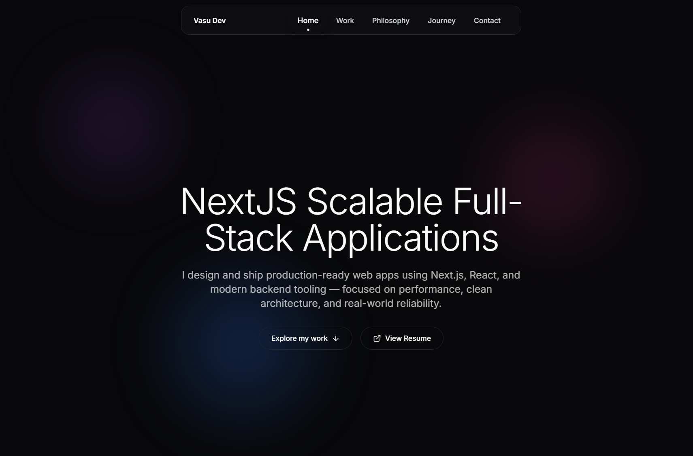

# 🌐 Personal Portfolio – Vasu

My personal developer portfolio built using **React, Tailwind CSS, GSAP, and EmailJS** to showcase my projects, skills, and journey as a frontend developer.

🚀 Live Website: https://vasusinghal.com  
📂 GitHub Repo: https://github.com/vasusinghal-dev/portfolio

---

## ✨ Features

- ⚡ Smooth animations with **GSAP**
- 🎨 Clean, modern UI with **Tailwind CSS**
- 🌙 Dark mode support
- 📱 Fully responsive design
- 📩 Working contact form using **EmailJS**
- 🧩 Modular, clean React component structure

---

## 🛠 Tech Stack

- **Frontend:** React, Tailwind CSS
- **Animations:** GSAP
- **Forms & Email:** EmailJS
- **Icons:** React Icons
- **Deployment:** Vercel (or Netlify)

---

## 📸 Preview

---

## 📬 Contact

If you'd like to collaborate or hire me:

- Email: **[contact@vasusinghal.com](mailto:contact@yourdomain.com)**
- LinkedIn: [https://linkedin.com/in/vasusinghal-dev](https://linkedin.com/in/vasusinghal-dev)
- GitHub: [https://github.com/vasusinghal-dev](https://github.com/vasusinghal-dev)

---

## 🧠 What I’m Currently Learning

- Backend fundamentals with Node.js
- API integration & real-world projects
- Improving UI responsiveness & design consistency

---

## 📜 License

This project is open-source and available under the MIT License.

---

> Built with ❤️ by Vasu
