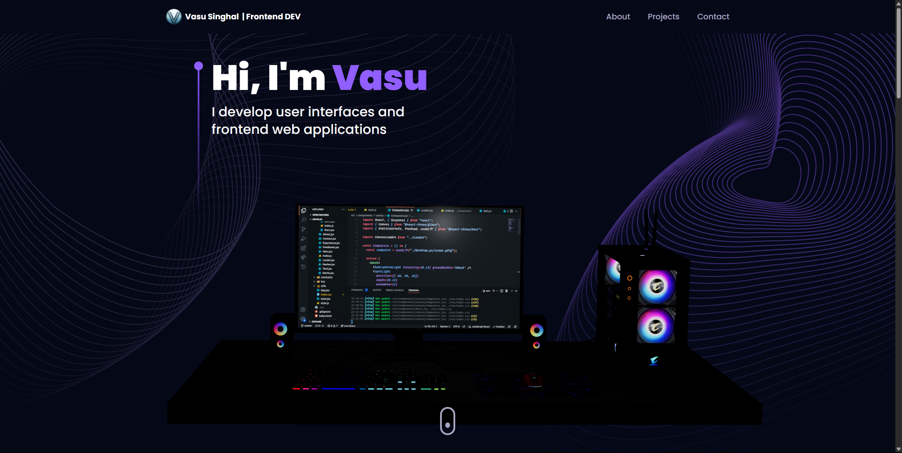
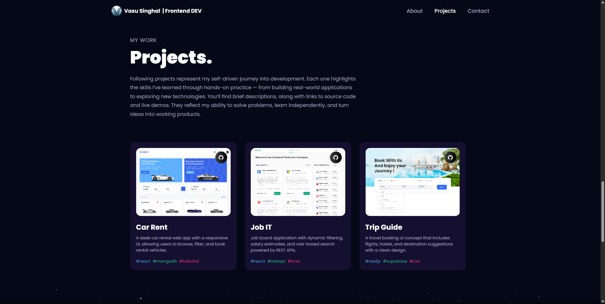
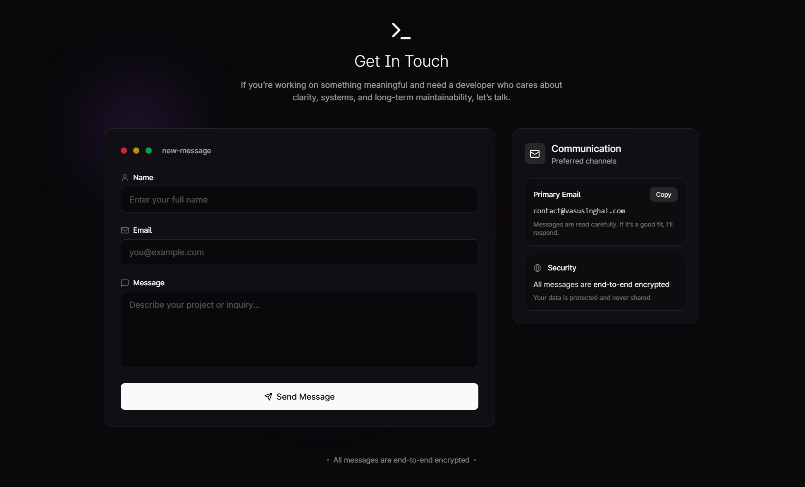

# 💼 Vasu Singhal - Frontend Portfolio

This portfolio is a reflection of my growth as a frontend developer, built while learning from **JavaScript Mastery** resources. It showcases my work with modern frontend technologies like **React**, **Three.js**, **Tailwind CSS**, and more.

## 📸 Screenshots

### 🚀 Hero Section



### 🧰 Projects Section



### 📬 Contact Section



---

## 🚀 Features

- Responsive and animated landing page using **Framer Motion**
- 3D computer model using **Three.js** with `@react-three/fiber`
- Skill section with floating icons rendered on interactive canvas
- Project cards with GitHub links and stack tags
- Fully functional contact form using **EmailJS**

---

## 🧑‍💻 Tech Stack

| Category            | Tools & Libraries                       |
| ------------------- | --------------------------------------- |
| **Languages**       | JavaScript, TypeScript, HTML5, CSS3     |
| **Frontend**        | React.js, Tailwind CSS, Redux Toolkit   |
| **Animations**      | Framer Motion, @react-three/fiber, Drei |
| **Backend (basic)** | Node.js, MongoDB (learning)             |
| **Utilities**       | Git, GitHub, Vite, EmailJS              |
| **Design**          | Figma, UI/UX Principles                 |

---

## 🧭 Sections Breakdown

### 🧍‍♂️ Hero

> Animated intro with a 3D canvas model, powered by Three.js and fiber.

### 👨‍🔧 About

Overview of who I am and what I do: frontend dev, UI/UX learner, backend explorer.

### 🚀 Tech Stack

Interactive spheres for each technology I use or am currently learning.

### 🧰 Experience

Timeline section showing my journey — currently working on freelance and personal projects.

### 📁 Projects

Each card includes:

- Live project screenshot
- Description and tech tags
- GitHub source code link

### 📬 Contact

A live contact form using **EmailJS** — works instantly and emails are delivered straight to my inbox.

---

## 📦 Getting Started

```bash
git clone git@github.com:vasusinghal-dev/portfolio.git
cd portfolio
npm install
npm run dev
```
